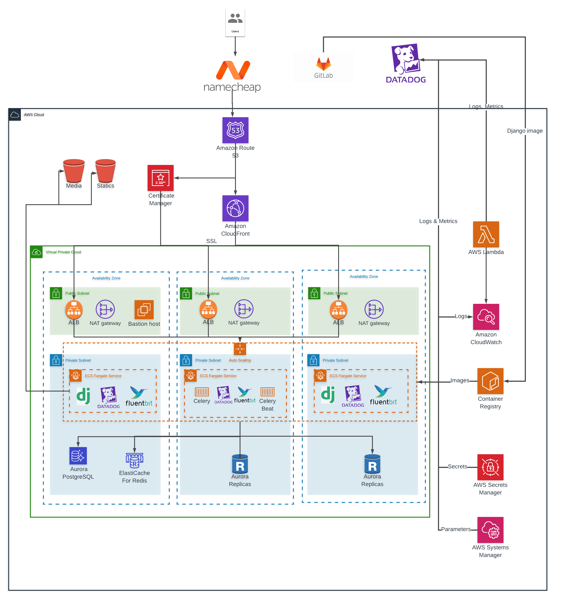

# Backend

## Stack
- Python 3.8
- Django
- Celery
- Uvicorn
- Redis
- PostgreSQL


## Get started

### Local setup

Start local dev server:
```sh
pip install -r requirements.txt
./bin/develop.sh
```

### Docker setup
Get latest docker & docker-compose:  
- https://www.docker.com/  
- https://docs.docker.com/compose/

```sh
docker-compose up -d
```

Wait for docker to set up containers, then open [http://localhost:8000](http://localhost:8000)


# CDK AWS infrastructure 


CDK installation

```
sudo npm install -g aws-cdk@latest
```

Python dependencies can be installed via **pip** or **piptools**
```
pip install -r infrastructure/requirements.txt
```

## Useful commands

 * `cdk ls`          list all stacks in the app
 * `cdk synth`       emits the synthesized CloudFormation template
 * `cdk deploy`      deploy this stack to your default AWS account/region
 * `cdk diff`        compare deployed stack with current state
 * `cdk docs`        open CDK documentation


# Infrastructure



[Link to edit]( https://lucid.app/lucidchart/13b27697-50f0-4b6d-b987-96bccc140160/edit?page=YGcM5DNywbTK#).

### VPC

 - NAT instances to allow internet access from private subnets
   - For cost savings it is enabled in only one AZ
 - Bastion host to enable access to vpc

### Load balancer 
- Application Load balancers which forward traffic and monitor ecs services
- SSL Certificates are taken from ACM

### Databases
- Aurora PostgreSQL in **private subnet**
- PostgreSQL in **private subnet**

### Elastic container service
Django service consists of 
- Django application
- Celery
- Datadog Daemon
- FluentBit Log shipper

### S3 buckets
- Media uploads bucket
- Static files buckets
  - During deployment, django static files are collected in folder named from RELEASE env variable (commit short sha)

    
### Gitlab Pipelines


### Pull requests

### Manual Image building and pushing to ECR

Retrieve an authentication token and authenticate your Docker client to your registry.
Use the AWS CLI:
```bash
aws ecr get-login-password --region ap-south-1 | docker login --username AWS --password-stdin 682452685130.dkr.ecr.ap-south-1.amazonaws.com
```
Build your Docker image using the following command. For information on building a Docker file from scratch see the instructions here . You can skip this step if your image is already built:
```bash
docker build -t django .
```
After the build completes, tag your image so you can push the image to this repository:
```bash
docker tag django:latest 682452685130.dkr.ecr.ap-south.amazonaws.com/worknetwork:latest
```
Run the following command to push this image to your newly created AWS repository:
```bash
docker push 682452685130.dkr.ecr.ap-south.amazonaws.com/worknetwork:latest
```
